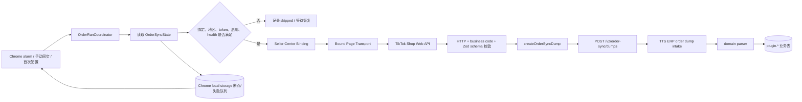

# Order Data Sync 插件业务逻辑梳理与正确性评审

> 状态：讨论稿（2026-09-29）  
> 范围：`chrome-plugins/order-data-sync` 与 TTS ERP `/v2/order-sync/*` 接收链路  
> 本文只做现状梳理和风险判断，不修改同步行为。

## 1. 结论摘要

插件目前不是 3 条管道，而是 **5 条已实现管道 + 1 条只有协议、没有采集 implementation 的管道**：

1. `orders`：订单列表；
2. `logistics`：逐订单物流详情；
3. `order_details`：逐订单完整详情；
4. `order_history`：逐订单状态历史；
5. `statements`：结算单及 SKU 级交易明细；
6. `after_sales`：TTS ERP wire contract 和服务端 parser 已存在，但插件没有 endpoint、alarm 或轮询实现。

整体架构方向是合理的：使用已登录 Seller Center Binding 发起 Bound Page Request，先验证 TikTok HTTP/业务码/schema，再按自然键 dump 到 TTS ERP；Chrome storage 保存断点，MV3 worker 重启后可续传；店铺、token 或服务地址变化后会阻止旧请求写入新作用域。

但当前不能把它描述为“订单、物流、结算、退款都已完整同步”。主要原因：

- **退款/售后没有独立采集管道**。现在只能从 `order/get.reverse_module` 和 `order/history` 间接看到部分退货退款信息，TTS ERP 的 `after_sales` / `after_sale_items` 表不会由本插件填充。
- **订单历史跨页存在确定的数据覆盖问题**：插件逐页上传，但服务端每页都从 `event_index=0` 写入，因此第 2 页会覆盖第 1 页相同索引的数据；而且抓包显示列表为最新在前，服务端注释却把 `0` 当作最早事件。
- **TTS ERP 不健康时的自动恢复有断链风险**：alarm 触发后会先把 domain 标为 running，再因 health gate 跳过；此时可能既不安排 continuation，也不安排下一日 alarm。恢复回调只尝试“首次同步”，已有 `lastRunAt` 时不会真正恢复。
- **永久失败没有从可重试队列中分离**：413、422 等不可恢复错误最终仍会进入 pending queue，并按约 6 秒 continuation 反复重试。

因此，当前判断是：

- 订单、物流、结算的主链路和防重/断点机制 **大体正确**；
- 退款业务目标 **尚未完成**；
- 订单历史落库存在 **跨仓库契约 bug**；
- 调度恢复与错误分类还需要修正后，才能称为可靠的长期自动同步。

---

## 2. 已保存的 Shop API response 证据

### 2.1 实际抓包文档

仓库中有实际响应内容，但主要保存为脱敏 Markdown，不是 HAR 或独立 JSON fixture。

| 文件 | 已保存内容 | 证据状态 |
| --- | --- | --- |
| `../codex-tiktok-shop-order-product-logistics-api.md` | `order/list`、`logistic_detail/list`、`statement/list/detail`、`statement/transaction/detail` 请求和脱敏响应摘要 | 实际抓包；文档标注验证日期 2026-09-08 |
| `docs/tiktok-fulfillment-order-apis.md` | `order/get` 和 `order/history` 的较完整脱敏 response；含 reverse、价格、买家、历史证据图片等字段 | 实际抓包；文档标注 2026-09-26 |

其中已确认：

- `order/list.data.main_orders[].main_order_id` 可以直接驱动物流详情请求；
- `logistic_detail/list.data.package_list` 可能一单多包裹；
- `order/get` 中已观察到 `reverse_module`；
- `order/history` 中已观察到退货申请、自动批准、寄回和退款完成等事件；
- `statement/list/detail` 能得到 `statement_id + statement_version`；
- `statement/transaction/detail` 需要额外的 `statement_sku_detail_id`。

### 2.2 没有保存的证据

当前没有发现：

- `.har` 文件；
- 可由测试直接加载的 TikTok 原始 response JSON corpus；
- `/api/v1/pay/statement/order/list` 的独立真实抓包样本；
- `/return_refund/202309/cancellations/search` 的真实成功 response；
- 能证明 `order/list` 空筛选条件覆盖“店铺全部历史订单”的未脱敏时间窗口证据。

`tests/` 内 response 都是手工构造的 inline fixture。它们能验证当前代码契约，但不能证明 TikTok 当前真实 payload 没有变化。

### 2.3 运行时响应保存

`src/extension/order-engine.ts::orderTikTokRuntimeExchange` 会把请求和响应放入 `runtimeLogs`，Popup 可导出日志；同时实际 response 也会进入上传给 TTS ERP 的 dump body。

这不是稳定的 golden fixture：

- runtime log 只保留最多 5,000 条；
- 导出依赖用户操作；
- sanitizer 主要处理 token/cookie 等凭证字段，不等价于完整 PII 脱敏；
- 不能直接作为自动回归测试输入。

---

## 3. 总体数据流



### 3.1 关键 module / seam

| module | interface / seam | 责任 |
| --- | --- | --- |
| `entrypoints/background.ts` | Chrome message、tab、alarm adapter | 启动、绑定、alarm 分发、Popup 命令 |
| `order-run-coordinator.ts` | `run / reserve / beginManual` | domain admission 和运行冲突规则 |
| `order-engine.ts` | `handleOrderSyncAlarm / pollOrderDomain` | 五条生产管道、分页、断点、续传 |
| `bound-page-transport.ts` | `request()` | page proxy、MAIN world、worker fetch adapter |
| `storage.ts` | `orderSyncStateStore.read/update` | Chrome storage 串行 mutation、迁移、规范化 |
| `order-sync.ts` | `uploadOrderSyncDump / fetchOrderSyncReconciliation` | TTS ERP HTTP client 与重试 |
| TTS ERP `plugin.orders.intake` | `intake_dump()` | 六域 dispatch、事务、parser、health 记录 |

---

## 4. 同步前置条件

一次 Sync Run 真正请求 TikTok 前，需要同时满足：

1. 已有 Seller Center Binding；
2. `boundTab.tabId` 和 `boundTab.sellerId` 存在；
3. 已获得 shop region；
4. TTS ERP sync token 非空；
5. `syncPaused=false`；
6. `orderDomainSyncEnabled=true`；
7. 内存中的 TTS ERP health 状态为 healthy。

订单作用域固定为：

```ts
{ sellerId: boundTab.sellerId, shopId: boundTab.sellerId }
```

这与 TTS ERP 的 contract test 一致；Advertiser ID 明确不参与订单域。

长任务在上传前会重新检查 seller、token、base URL 和运行 ID。绑定或同步目标在执行中变化时，旧结果不会写入新店铺/新服务端。

---

## 5. 什么时候同步

### 5.1 首次同步

`ensureBoundDomainAlarms()` 在以下场景执行：

- MV3 background 启动；
- 保存配置；
- Seller ID 捕获成功；
- 自动/手动绑定成功或修复；
- 绑定页面切换或登录恢复。

如果 store 从未记录过订单域运行（`orderProgress.lastRunAt` 为空），会立即执行首次同步：

1. 订单列表；
2. 订单分页产生物流、订单详情、订单历史消费者；
3. 结算单同步。

如果订单 pipeline 没启动，则独立触发物流、详情和历史。

### 5.2 日常自动同步

五个 domain 都使用 one-shot Chrome alarm；完整一轮成功/结束后再创建下一次 alarm。

| domain | 主 alarm | 正常间隔 |
| --- | --- | ---: |
| orders | `order-data-sync:orders` | 24 小时 |
| logistics | `order-data-sync:logistics` | 24 小时 |
| statements | `order-data-sync:statements` | 24 小时 |
| order_details | `order-data-sync:order-details` | 24 小时 |
| order_history | `order-data-sync:order-history` | 24 小时 |

### 5.3 continuation

未处理完或有失败项时，使用独立 continuation alarm：

- `orders:continue`
- `logistics:continue`
- `statements:continue`
- `order-details:continue`
- `order-history:continue`

延迟 `0.1` 分钟，即约 6 秒。自动任务遇到其他 domain 占用时，延后 1 分钟。

### 5.4 手动同步

Popup 可发起：

- 全部 domain 同步；
- 只重试包含 `lastError / pending / failed / partial_failed / interrupted` 的 domain；
- 停止超过 2 分钟无进展的卡住任务并重试。

手动任务要求当前没有正常运行中的 domain；不能和后台工作重叠。

### 5.5 Seller Center 页面维护

- 绑定页面达到 120 分钟后才允许刷新；
- 页面正在被另一插件或本插件使用时，5 分钟后重试；
- Seller 身份丢失、登录失效或页面被关闭时，保留同步断点，扫描替代页面；
- watch alarm 延迟 1 分钟。

---

## 6. 各同步管道

## 6.1 Orders：订单列表

### TikTok 请求

- `POST /api/fulfillment/order/list`
- 每页 20 条；
- `sort_info="6"`，当前代码假设为降序；
- 同时维护 offset、search cursor、pagination type；
- 最大 500 页。

### 选择策略

首次或无法 reconcile 时走 full/fallback/repair。已有 checkpoint 时：

- 保存 total、头/中/尾锚点；
- hot window = 40；
- 历史轮转 audit window = 40；
- 每 24 小时强制 exact audit；
- 服务端 `/v2/order-sync/reconcile` 返回 anchor 与 `canIncremental/offsetSafe`；
- 锚点位移或 reconcile 不可信时保守回退。

### 上传粒度

插件不是把整页 envelope 原样上传，而是把每个 `main_order` 单独作为一个 `orders` dump：

- `mainOrderId` = 订单 ID；
- `response.body` = 单个订单 row；
- TTS ERP parser 同时兼容完整 envelope 和单 row。

### 下游 fan-out

订单页完成后，把该页订单 ID 交给三个独立消费者：

- logistics；
- order_details；
- order_history。

结算不是按订单号查询，因此不会在每个订单页重复启动。

### 评价

**基本正确。** 分页、跨页去重、anchor repair、scope guard 和服务端自然键 upsert 形成了较完整的幂等链路。

**待确认：** 请求没有显式创建时间范围，抓包 response 又包含 `default_search_create_time`。因此目前无法证明空 `condition_list` 能覆盖“店铺从开店日至今的全部历史订单”。

## 6.2 Logistics：物流详情

### TikTok 请求

- 订单 ID 来源：服务端 reconcile 候选，失败时回退订单列表；
- `GET /api/v1/fulfillment/logistic_detail/list?main_order_id=...`；
- 每单一个请求；
- 每批最多 50 单；
- 逐单失败不会阻塞其他订单。

### 终态规则

只有订单所有 line 的 `main_order_status` 都是 `104` 时，才跳过物流；混合状态订单仍查询。

TTS ERP reconcile 也会返回 terminal logistics item，减少无意义刷新。

### 上传与落库

- dump domain：`logistics`；
- `mainOrderId` 必填；
- 服务端写 `shipments` 和 `tracking_events`；
- 一单多包裹由服务端 parser 支持。

### 评价

**主逻辑正确。** 多包裹、混合状态、逐单失败和作用域变化都处理得较稳健。

**业务时效风险：** 完整轮次默认每天一次。运输轨迹是高频可变数据，如果 ERP 需要小时级物流状态，24 小时 SLA 不够。

## 6.3 Order details：订单完整详情

### TikTok 请求

- `POST /api/fulfillment/order/get`；
- body：`{ main_order_id: [id] }`；
- 每单一个请求，每批最多 50；
- 已取消订单也保留，因为详情内可能有价格、退款、买家和逆向信息。

### 上传与落库

- dump domain：`order_details`；
- 插件先通过 `OrderGetResponseSchema`；
- TTS ERP 写 `order_details`；
- 原始 order object 保存在 `raw_payload`。

服务端规范化字段只取：

- 第一条 `order_status_module`；
- 第一条 `delivery_module`；
- 第一条 `reverse_module`。

### 评价

**作为订单快照管道基本正确。** 它确实补齐了订单列表之外的金额、买家、仓库、物流和逆向字段。

**但不能代替完整售后管道：** 一个订单可能有多个 reverse record；规范化表只取第一条，其他记录只留在 raw JSON，且不会写入 `after_sales` / `after_sale_items`。

## 6.4 Order history：订单历史

### TikTok 请求

- `POST /api/v1/fulfillment/order/history`；
- body：`{ main_order_id, offset, page_size: 10 }`；
- 按 `total_count` 读取所有页；
- 最大 500 页；
- 取消订单仍保留，用于捕获取消/退款时间线。

### 上传与落库

- 每一页单独上传一个 `order_history` dump；
- request body 中有本页 offset；
- TTS ERP API adapter 当前丢弃 dump.request，只把 response body 和 mainOrderId 交给 parser；
- parser 在每一页内执行 `enumerate(history)`，以 0 开始写 `event_index`；
- 唯一键是 `(shop_id, order_id, event_index)`。

### 评价

**存在确定的跨页覆盖 bug。**

例：

- 第 1 页事件写入 index `0..9`；
- 第 2 页 parser 再次写入 index `0..9`；
- repository 使用相同唯一键 upsert，因此第 2 页覆盖第 1 页。

此外，实际抓包显示 `order_history` 为最新事件在前；服务端 parser 注释却写“0 = 最早事件”，当前实现没有 reverse。

建议修复方向：

1. intake 把 request offset 传给 history parser，并使用 `event_index = offset + pageIndex`；或
2. 更稳妥地改用 TikTok event ID/时间戳+内容 hash 作为自然键；
3. 明确 `event_index=0` 是最新还是最早，并在 parser 中统一排序。

## 6.5 Statements：结算单与 SKU 交易明细

### TikTok 请求

第一层：

- `GET /api/v1/pay/statement/list/detail`；
- page size 50；
- 使用 `from += 本页行数`；
- 最大 500 页；
- 每轮全量刷新，不使用“已存在即跳过”。

第二层：

- 对每个 statement 调用 `/api/v1/pay/statement/order/list`；
- 两个 variant：`settlement_status=1,page_type=10` 与 `settlement_status=2,page_type=6`；
- 提取并去重 `statement_sku_detail_id`。

第三层：

- `GET /api/v1/pay/statement/transaction/detail`；
- 校验返回的 statement ID、version 和 SKU detail ID 与请求完全一致；
- 上传 statement header 和每个 SKU detail。

### 上传与落库

统一使用 domain `statements`：

- 有 `data.sku_record` 时服务端走 transaction parser，写 `settlement_details`；
- 否则走 statement-list parser，写 `settlements`。

### 评价

**服务端 dispatch 与插件 dump shape 对齐，身份校验也较强。**

风险：

1. 真实抓包文档没有保存中间 `/statement/order/list` 成功样本，目前 endpoint method/query/两个 variant 主要由代码和合成测试证明；
2. response 暴露 `search_next_cursor`，生产代码仍只用 `from`。当结算列表同步期间发生插入/重排时，offset 分页可能重复或漏项；
3. 断点只到 statement 级，不到 SKU detail 级。一个超大 statement 在 MV3 worker 中途终止后，会重做该 statement 已完成的所有 detail；
4. 24 小时全量刷新是否满足财务时效，需要业务确认。

## 6.6 After sales / Refunds：售后退款

### 当前实际状态

插件侧：

- wire enum 有 `after_sales`；
- Popup display type 有 `after_sales`；
- **没有生产 domain key、alarm、endpoint builder、poll dispatcher 或 queue**。

服务端：

- `DumpDomain.AFTER_SALES` 已接入；
- parser 预期 `/return_refund/202309/cancellations/search`；
- 写 `after_sales` 和 `after_sale_items`；
- parser 文档明确说 payload 是按业务规则假设设计，Chrome 尚未抓到真实成功数据。

### 评价

**业务目标未完成。**

当前能获得的退款信息只有：

- `order/get.reverse_module` 的部分逆向字段；
- `order/history` 的自然语言时间线和证据；
- statement detail 中可能出现的财务调整。

这些信息不能稳定替代结构化的退款/退货实体，尤其缺少多行项目、退款金额、售后状态生命周期和一单多售后单关系。

---

## 7. 断点、失败和并发语义

### 7.1 Durable state

Chrome local storage 保存：

- 当前/待处理/失败订单 ID；
- resume ID；
- list offset、cursor、page；
- anchor checkpoint；
- syncRunId、trigger、run status；
- last success/error/next sync time。

每个 item 开始、成功、失败后都会落盘。失败项移到队尾，避免一个坏订单饿死后续订单。

### 7.2 批次

- orders / logistics / details / history / statements：每批最多 50 个顶层 item；
- TikTok list page：20；
- statement list page：50；
- order history page：10；
- N+1 item 请求间隔：3 秒；
- TikTok 全局 request admission：最多 1 个 in-flight，启动间隔至少 500ms。

物流、详情、历史可以作为三个 consumer 并行推进，但所有 TikTok 请求最终共享单 lane，因此不会真正并发打 Seller Center。

### 7.3 TTS ERP upload retry

单次 dump：

- 最多 3 次网络尝试；
- network、429、5xx 可重试；
- 429 支持 `Retry-After`，上限 60 秒；
- 413 标为 permanent；
- 422 等非 2xx/非 429/非 5xx 标为 permanent；
- 400 被特别标为 retryable，交给 durable queue。

但上层 batch 目前不区分 `OrderSyncError.code`，任何异常都会进入失败队列。因此 permanent 只在 HTTP client 内有分类，在业务 queue seam 上失效。

### 7.4 MV3 restart

续传设计总体合理，但有两个粒度问题：

- statement 只在整个 statement 完成后才能移出 pending；
- order history 只在一个订单全部页面完成后才能移出 pending。

长子流程中断会从该顶层 item 开始重做，而不是从 SKU detail/page 继续。

---

## 8. 与 TTS ERP 服务端契约的对齐情况

| 项目 | 结论 |
| --- | --- |
| `/v2/order-sync/dumps` URL、protocol version、2 MiB 上限 | 对齐 |
| HTTP 2xx + `code=0` 才算成功 | 对齐 |
| `orders` 单 row shape | 服务端明确兼容 |
| `logistics` 要求 mainOrderId | 对齐 |
| `order_details` / `order_history` schema | 对齐；history 分页 index 语义不对齐 |
| `statements` list/detail 通过 payload shape 分流 | 对齐 |
| `after_sales` | 服务端已准备，插件未生产 |
| sellerId / shopId | 两端测试均使用同一个 Seller 店铺 ID |
| reconciliation | 仅 orders/logistics；两端 schema 对齐 |
| 幂等 | 服务端自然键 upsert；插件允许安全重放多数 dump |
| 失败原子性 | 服务端 parse failure 回滚业务行并记录 health |

---

## 9. 正确性问题与优先级

| 优先级 | 问题 | 业务影响 | 建议 |
| --- | --- | --- | --- |
| P0 | order history 多页都从 event_index=0 upsert | 历史页互相覆盖；退款/取消时间线丢失 | 建立带 offset 或稳定 event key 的跨仓库契约测试并修复 |
| P0/P1 | 没有 after_sales 采集管道 | 退款数据不完整，服务端售后表为空 | 先抓真实成功 response，再定义 endpoint schema、分页和增量规则 |
| P1 | health gate 跳过后可能不再安排 alarm；恢复回调只走首次同步 | 服务恢复后 domain 可能永久卡在 running，直到页面事件或人工干预 | gate 前不要 begin run；或 skipped 时明确安排 continuation；恢复时触发 resume 而不是 initial-only |
| P1 | permanent upload error 仍进入 continuation queue | 413/422 数据会无限重试并制造日志/请求风暴 | queue 按 retryable/permanent/needs-human 分类 |
| P1 | order/list 没有显式历史时间范围 | 可能只同步 Seller Center 默认窗口，无法证明历史完整性 | 确认 `default_search_create_time`，明确开店日起始和时间窗分页策略 |
| P1/P2 | 全部可变 domain 正常间隔都是 24h | 物流和退款状态可能延迟一天 | 先定义业务 SLA，再按 domain 使用不同周期 |
| P2 | statement/order/list 无真实 fixture，statement list 忽略 cursor | TikTok 合约漂移或列表变动时可能漏/重 | 补抓包；优先按 cursor 前进并加非前进保护 |
| P2 | statement/history 子步骤没有细粒度断点 | 大 statement 或长历史在 MV3 重启后反复重做 | 保存 detail/page cursor，或拆成独立 durable unit |
| P2 | 详情表只规范化第一条 reverse/delivery/status | 多售后、多包裹信息只能在 raw 中查询 | 售后独立建模；多包裹继续以 logistics 为准 |
| P2 | 没有 replayable response fixture corpus | schema 与真实 TikTok response 可静默漂移 | 脱敏保存 golden JSON，并做 plugin→server 跨仓库 contract test |
| P2 | runtime logs 保存大块 raw exchange | 可能包含买家/地址等敏感业务数据，且占用 5,000 条日志额度 | 明确 retention/PII policy，默认仅保存 shape，按诊断开关保存 raw |
| P3 | README 仍写 0.1.23，package 已是 0.1.28；pure flow 的并发描述与生产不完全一致 | 维护者容易依据旧文档判断错误 | 更新文档并明确生产 pipeline 是权威实现 |

---

## 10. 建议的讨论顺序

建议先确认业务契约，再改代码：

1. **退款的权威 source 是什么？**
   - 独立 cancellation/return/refund endpoint；
   - 还是 order detail/history 足够；
   - 退款金额和行项目以哪个 response 为准？
2. **订单历史是否需要完整时间线？**
   - 如果需要，P0 跨页覆盖必须先修；
   - event index 应按最新→最旧还是最旧→最新？
3. **数据时效 SLA 是多少？**
   - 订单、物流、退款、结算分别允许延迟多久；
   - 是否接受统一每天一次？
4. **历史覆盖范围是什么？**
   - 仅 Seller Center 默认窗口；
   - 最近 N 天；
   - 从店铺开店日开始全部回填。
5. **不可解析数据怎么处理？**
   - 永久失败进入 needs-human/dead-letter；
   - 还是无限自动重试。
6. **是否允许保存脱敏 golden response？**
   - 建议至少为六个 domain 各保存一个成功样本、一个空样本、一个结构异常样本；
   - 增加 plugin dump → TTS ERP parser 的跨仓库测试。

---

## 11. 主要证据索引

### 插件

- `src/extension/order-engine.ts`
  - alarm 常量、间隔和 batch size；
  - `fetchOrderRowsForRound`；
  - `createOrderPagePipeline`；
  - `processOrderDomainBatch`；
  - `processLogisticsBatch`；
  - `processOrderDetailsBatch`；
  - `syncOrderHistoryPages`；
  - `fetchStatementRows`；
  - `fetchStatementSkuDetailRefs`；
  - `pollOrderDomainOnce`；
  - `ensureBoundDomainAlarms`。
- `src/core/tiktok-order-endpoints.ts`
- `src/core/tiktok-statement-endpoints.ts`
- `src/core/order-sync.ts`
- `src/core/order-sync-schemas.ts`
- `src/core/types.ts`
- `entrypoints/background.ts`
- `docs/tiktok-fulfillment-order-apis.md`
- `../codex-tiktok-shop-order-product-logistics-api.md`

### TTS ERP

- `tts_erp_v2/api/v2/order_sync.py`
- `tts_erp_v2/plugin/orders/intake/_service.py`
- `tts_erp_v2/plugin/orders/intake/_types.py`
- `tts_erp_v2/plugin/orders/parser.py`
- `tts_erp_v2/plugin/orders/repository.py`
- `tests/api/test_order_sync_contract.py`
- `tech-doc/dumps-data-contract.md`

### 现有测试覆盖

- `tests/order-sync-polling.test.ts`
- `tests/order-sync-concurrency.test.ts`
- `tests/order-sync.test.ts`
- `tests/tiktok-order-endpoint-schemas.test.ts`
- `tests/tiktok-statement-endpoint-schemas.test.ts`
- `tests/tiktok-order-statement-flow.test.ts`

现有测试已覆盖大量单仓库行为，但尚缺最关键的两个跨仓库场景：

1. order history 第 2 页不能覆盖第 1 页；
2. after_sales 真实 response 从插件采集到服务端业务表的端到端契约。
